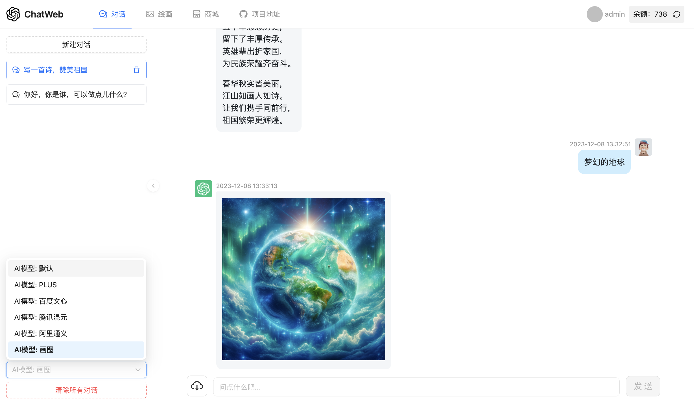
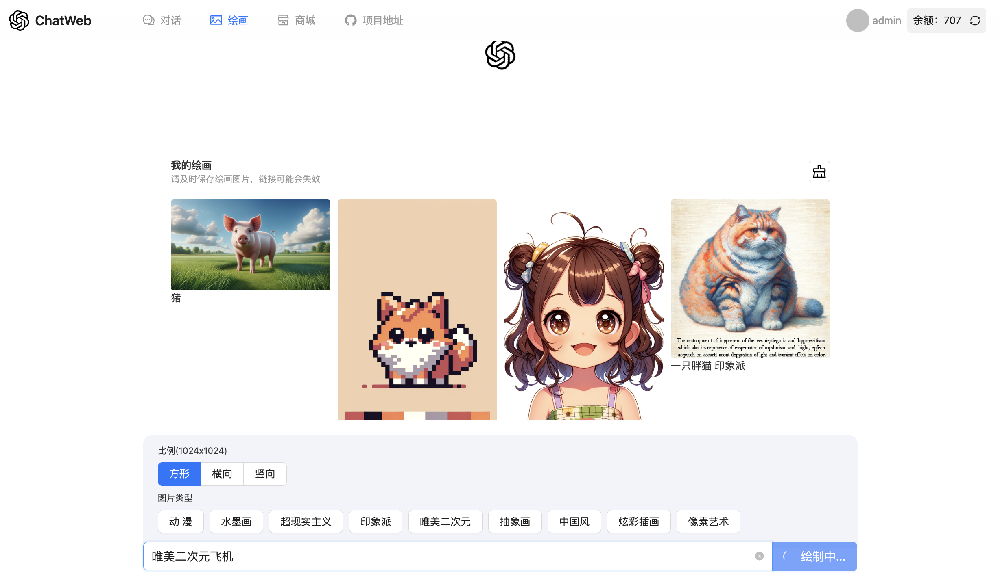
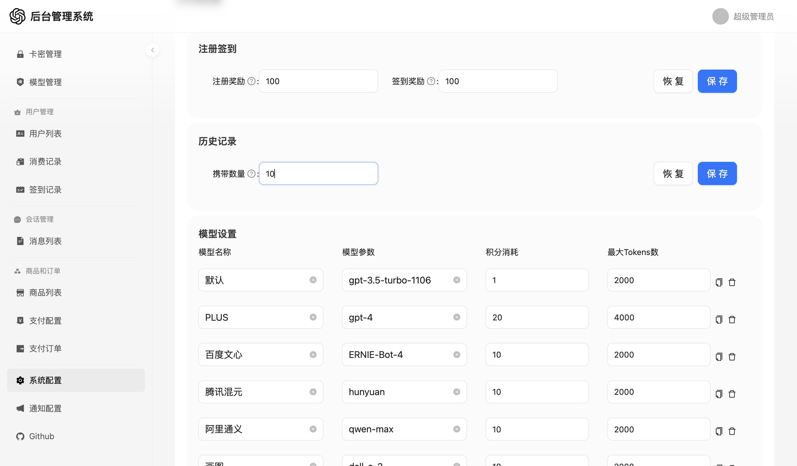

# ChatGPT Web

基于 [79E/ChatGpt-Web](https://github.com/79E/ChatGpt-Web) 项目二次开发的商业化 ChatGpt 网页应用。

### 页面截图

  

## 主要功能

- 后台管理系统，可对用户，Token，商品，卡密等进行管理
- 精心设计的 UI，响应式设计
- 支持 DALL·E-3 模型
- 支持 GPT-3.5、GPT-4.0 等模型
- 支持 自定义国内大模型，需搭配 [songquanpeng/one-api](https://github.com/songquanpeng/one-api) 或其他中转使用

## 运行环境

- Node 版本: `node` 需要 `^16 || ^18 || ^19` 版本（node >= 16.19.0），可以使用 nvm 管理本地多个 node 版本
- 数据库: MYSQL + Redis
- 新建一个名称，用户名，密码均为 `chatgpt` 的 MYSQL 数据库，导入 `/sql/chatgpt.sql`

## 项目部署

### 拉取项目

```
git clone https://github.com/vastxie/ChatGpt-Web.git
```

在 `server/config/index.js` 中修改 `后端端口` `数据库` `邮箱` 等配置

自行安装好 node 、yarn 及 pm2 管理器

```
## 安装依赖
yarn install

## 打包
yarn build

## 启动
pm2 start
```


新建一个网站，ssl 验证后，反向代理 `http://127.0.0.1:3200`

- 后台地址：https://网站域名/admin
- 默认账号：admin@ai.com
- 默认密码：admin123456

## 更多

关于 `node` `yarn` `pm2` 的一些设置可以自行搜索或向 [GPT](https://asst.ligthai.cloud) 提问

## 贡献者

感谢 [79E](https://github.com/79E) 以及所有的 [项目贡献者](https://github.com/vastxie/ChatGPT-Web/graphs/contributors)

## 开源协议

[](https://github.com/vastxie/ChatGpt-Web/blob/master/license)
